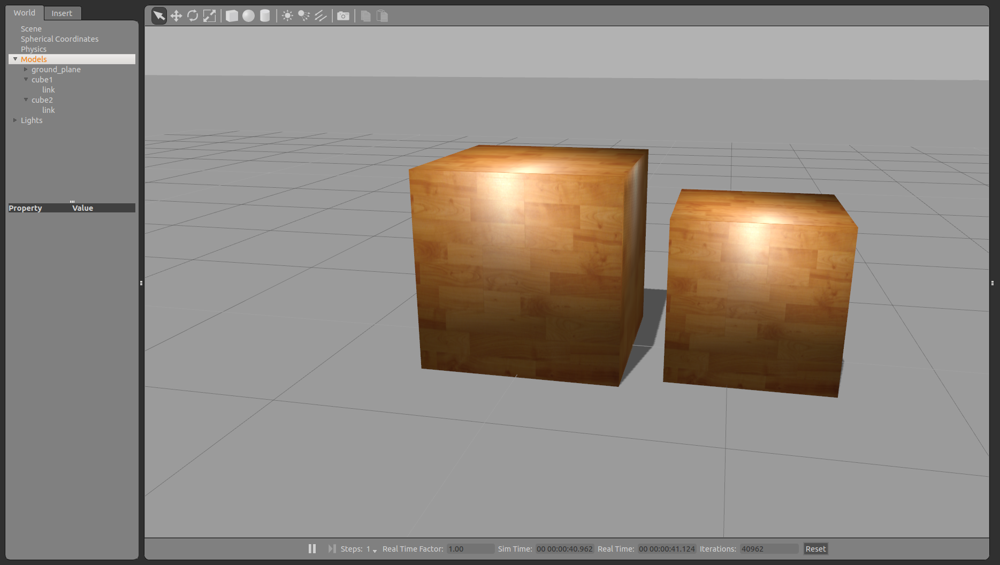

Attach two Gazebo models with a virtual joint in a generalized grasp hack

# Build

````
mkdir -p gazebo_link_attacher_ws/src
cd gazebo_link_attacher_ws/src
catkin_init_workspace
git clone https://github.com/pal-robotics/gazebo_ros_link_attacher.git
cd ..
catkin_make
source devel/setup.bash
````

<!-- rosservice call /link_attacher_node/attach "model_name_1: 'unit_box'
link_name_1: 'link'
model_name_2: 'unit_sphere'
link_name_2: 'link'" -->

<!-- rosservice call /link_attacher_node/detach "model_name_1: 'iiwa'
link_name_1: 'iiwa_link_7'
model_name_2: 'tool_example'
link_name_2: 'tool'" -->

<!-- rosservice call /link_attacher_node/attach "model_name_1: 'modulo'
link_name_1: 'link'
model_name_2: 'tool_example'
link_name_2: 'tool'" -->

<!-- rosservice call /link_attacher_node/detach "model_name_1: 'modulo'
link_name_1: 'link'
model_name_2: 'tool_example'
link_name_2: 'tool'" -->

<!-- rostopic pub /link_attacher_node/detach std_msgs/String "data: 'tool_example'"-->

<!-- rosservice call /link_attacher_node/detach "model_name_1: 'iiwa'
link_name_1: 'iiwa_link_7'
model_name_2: 'gripper'
link_name_2: 'gripper'" -->

<!-- rosservice call gazebo/delete_model '{model_name: tool_example}' -->

<!-- rosrun gazebo_ros spawn_model -file /home/lincoln/iiwa_stack_ws/src/iiwa_stack_surgery/operating_room/models/gripper/model.sdf -sdf -model gripper -y -0.005 -x -0 -z 1.264 -->

<!-- rosrun gazebo_ros spawn_model -file /home/lincoln/iiwa_stack_ws/src/iiwa_stack_surgery/operating_room/models/tool_example/model.sdf -sdf -model tool_example -y -0.0 -x 0.2 -z 2.3 -R 0.0 -P 0.0 -Y 0.0 -->


# Launch

    roslaunch gazebo_ros_link_attacher test_attacher.launch

Empty world with the plugin `libgazebo_ros_link_attacher.so` loaded (in the *worlds* folder).

Which provides the `/link_attacher_node/attach` service to specify two models and their links to be attached.

And `/link_attacher_node/detach` service to specify two models and their links to be detached.



# Run demo

In another shell, be sure to do `source devel/setup.bash` of your workspace.

    rosrun gazebo_ros_link_attacher spawn.py

Three cubes will be spawned.

    rosrun gazebo_ros_link_attacher attach.py

The cubes will be attached all between themselves as (1,2), (2,3), (3,1). You can move them with the GUI and you'll see they will move together.

    rosrun gazebo_ros_link_attacher detach.py

The cubes will be detached and you can move them separately again.

You can also spawn items with the GUI and run a rosservice call:
````
rosservice call /link_attacher_node/attach "model_name_1: 'unit_box_1'
link_name_1: 'link'
model_name_2: 'unit_sphere_1'
link_name_2: 'link'"
````

And same thing to detach:
````
rosservice call /link_attacher_node/detach "model_name_1: 'unit_box_1'
link_name_1: 'link'
model_name_2: 'unit_sphere_1'
link_name_2: 'link'"
````


# Current status
It works!

~~Currently it crashes with:~~

````
***** Internal Program Error - assertion (self->inertial != __null) failed in static void gazebo::physics::ODELink::MoveCallback(dBodyID):
/tmp/buildd/gazebo4-4.1.3/gazebo/physics/ode/ODELink.cc(178): Inertial pointer is NULL
Aborted (core dumped)
````

~~Which I've only seen this other useful information: [Bitbucket gazebo removing moving model with ode friction fails](https://bitbucket.org/osrf/gazebo/issues/1177/removing-moving-model-with-ode-friction). But it didn't help me solve my crash. I guess when attaching one model to the other it removes the second one to re-create it attached to the first or something like that.~~

~~And also this other issue: [Visualizing dynamically created joints](https://bitbucket.org/osrf/gazebo/issues/1077/visualizing-dynamically-created-joints) made me add a couple of lines more.~~

~~The method to attach the links is based on the grasp hack of the Gripper in gazebo/physics:
[Gripper.hh](https://bitbucket.org/osrf/gazebo/src/1d1e3a542af81670f43a120e1df7190592bc4c0f/gazebo/physics/Gripper.hh?at=default&fileviewer=file-view-default)
[Gripper.cc](https://bitbucket.org/osrf/gazebo/src/1d1e3a542af81670f43a120e1df7190592bc4c0f/gazebo/physics/Gripper.cc?at=default&fileviewer=file-view-default)~~

~~Which is to create a revolute joint on the first model (with range of motion 0) linking a link on the first model and a link on the second model.~~